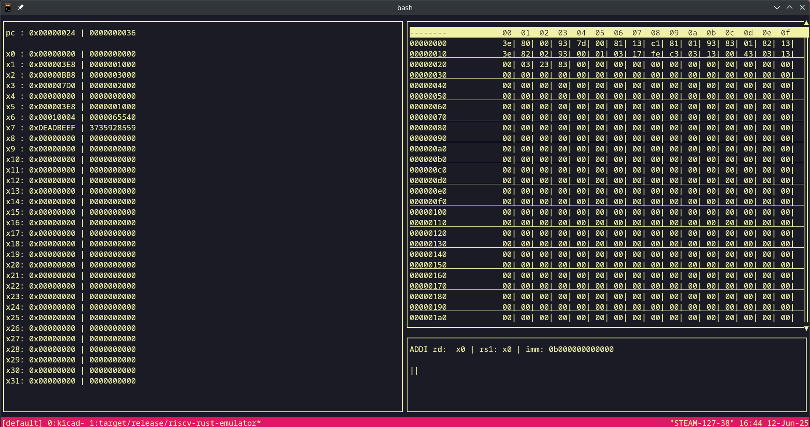

# RISC-V Emulator built in Rust

This is a very simple RV32I emulator I built as a project to help me get more familiar with ISAs and RISC-V.
It also includes a TUI frontend built with Ratatui to display the current instruction, registers, and memory.

